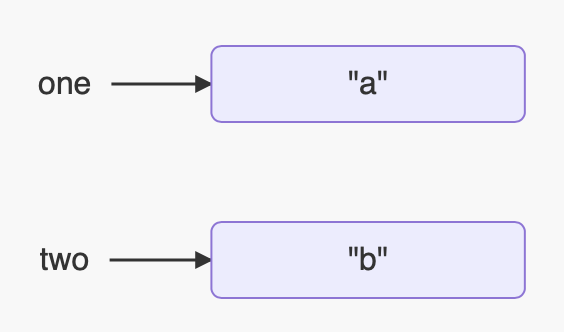
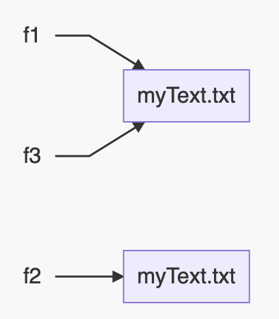

# Chapter 1

## Packages

Packages are related to the directory path. Assuming the following file stucture:

```
src
├── packagea
│   └── ClassA.java
└── packageb
    └── ClassB.java
```

…ClassA may look like this:

```java
package packagea;

import packageb.ClassB;
// or
import packageb.*;

public class ClassA {
    public static void main(String[] args) {
        ClassA a = new ClassA;
        ClassB b = new ClassB;
        
        boolean boola = a.doThing();
        boolean boolb = b.doThing():
    }
    
    public boolean doThing() {
        ...
    }
}
```


## Imports

If you want to use a library of code, you can use the keyword `import`. You can use `*`, or wildcard import to import all classes under the same package.

Java will automatically import `java.lang.*;` 

Considering the following code:

```java
public class Imports {
    public void read(Files files) {
        Paths.get("name");
    }
}
```

The two solutions to make this compile are:

```java
import java.nio.file.*;
// or
import java.nio.file.Files;
import java.nio.file.Paths;
```


You cant' do the following:

```java
import java.nio.*; // wildcard only matches classnames
import java.nio.*.*; // you can only have 1 wildcard, and it must be at the end
import java.nio.file.Paths.*; // you can't import methods
```


If there are name conflicts, for example:

```java
import java.util.*;
import java.sql.*; // both packages contain a Date class
```

…then it can be fixed like so:

```java
import java.util.Date;
import java.sql.*;
```

Explicit imports take precidence over wildcard imports.

If you needed to use both Date classes, then you can do one of two things:

1.  Import one, and use the fully qualified name for the other

```java
import java.util.Date;

public class Conflicts {
    Date date;
    java.sql.Date sqlDate;
}
```

2.  Both use fully qualified names

```java
public class Conflicts {
    java.util.Date utilDate;
    java.sql.Date sqlDate;
}
```


## Variables

#### Flavours

-   Instance variables (non-static) - A variable whose values **are** unique across each class _instance_ - "Two `User` classes would have different usernames"
-   Class variables (static) - A variable whose values **aren't** unique across each class instance   - "Two `User` classes would be under the same website"
-   Local variables - A variable whose scope is limited within a method
-   Parameters - Variables that are passed within methods (same as local)

```java
public class User {
    
    private static String websiteName = "Twitter"; // Class variable
    
    private String username; // Instance variables
    private String password;
    
    public User(String username, String password) {
        this.username = username;
        this.password = password;
    }
    
    public boolean validateUser() {
        private String hashSaltPassword = hashSaltPassword(password);
        			// Local variable
        
        if (hashSaltPassword.equals(getPasswordFromDbByUser(username))) {
            											 // Parameter
            return true;
        }
        return false;
    }
    
    ...
    
}
```


#### Scope

-   Local variables have a scope from declaration to end of block
-   Instance variables have a scope from declaration until object garbage collection collected
-   Class variables have a scope from declaration until program ends


```java
public class Test {
    
    public void testMethod() {
        int x = 0; // this variable's scope spans the whole method
        while (x <= 10) {
            int squareX = x * x; // this variables scope spans only the while loop
            System.out.println(squareX);
            x = x + 1;
        }
        System.out.println(squareX); // not allowed!
    }
    
}
```


#### Naming

A Java variable must begin with either:

-   A letter - `A-Z` or `a-z`
-   A Dollar sign - `$`
-   An Underscore - `_`

Subsequent characters may be:

-   Letters
-   Dollar signs
-   Underscores
-   Digits

Naming conventions:

-   Instance, Class, and Local variables should be `camelCase`
-   Constants and enums should be `CAPITAL_SNAKE_CASE`
-   Class names should be `TitleCase` 
-   Variable names cannot be keywords


#### Declaration

As Java is a strongly-typed language, any variable you declare should include the object its refering to. This is typically done like so:

```java
String hello;
Date christmas;
MyObject myVariableName;
```


We can also declare multiple variables in the same statement with a comma:

```java
String hello, world;
// variables declared:
// hello = null
// world = null

String hello = "Hello", world = "World";
// variables declared:
// hello = "Hello"
// world = "World"
```


There can be some interesting declarations, like so:

```java
boolean b1, b2; // legal: two booleans declared
boolean b3 = true, b4; // legal: two booleans declared and b3 initialised
boolean b5, boolean b6; // not legal: not allowed, no variables declared
boolean b7; boolean b8; // legal: two seperate statements (;), two booleans declared
boolean b9; b10; // not legal, b10 has no type associated
```


## Comments

Comments aren't executable, can be placed anywhere, and can help explain some code. There are three different types of comments in Java:

```java
// Single-line comment

/*
Multi-line comment 
*/

/**
Javadoc comment
*/

```

Javadoc comments have a specific structure and are recognised by the Javadoc tool. All comments are ignored by the compiler.


## Constructors

Constructors are what create objects. They look like methods without a return type, named the exact same as the class.

```java
class Construct {
    
    public Construct() { // constructor
        ...
    }
    
    public void Construct() { // regular method that returnes void, named 'Construct()'
        ...
    }
    
    public static Construct() { // not a thing
        ...
    }
    
}
```


Constructor overloading is the concept of having more than one constructor in your class. This can be used for many different things, like doing different things with differnet parameters:

```java
class Construct {
    
    public Construct() {
        System.out.println("Nothing passed!");
    }
    
    public Construct(int i) {
        System.out.println("Integer passed!");
    }
    
    public Construct(String s) {
        System.out.println("String passed!");
    }
    
    public static void main(String[] args) {
        Construct c1 = new Construct();
        Construct c2 = new Construct(51);
        Construct c3 = new Construct("Hello!");
    }
    /* output:
    	> Nothing passed!
    	> Integer passed!
    	> String passed!
    */
    
}
```

>   Note: Java will provide an empty constructor if you don't specify one.

## Compiling

In order to compile, you need an entry point: the `main()` method.

A `main()` method _must_ be the following*:

```java
class Main {
    public static void main(String[] args) { // * args can be named anything as it's a variable.
        ...
    }
}
```

There can be only one in the one class.

```java
class MainOne {
    
    public static void main(String[] args) {
    	System.out.println("Legal!");
	}
    
}

...

class MainTwo {
    
    public static void main(String[] args) {
    	System.out.println("Also legal!");
	}
    
}
```


In order to compile this (manually) you need to go to the terminal. Using `Main` as an example:

1.  Navigate to where the class is located
2.  Type `javac Main.class`
3.  Type `java Main`

A file must have the `.java` extension to compile. The name of the file must match the class name too. The result of this is bytecode, which contains instructions for the JVM to carry out. This file has the `.class` extension. We ommit the `.class` extension in the 2nd command as `.` is reserved for packages.

`String[] args` is the stuff that can come after the command. If we compile a class like this:

```java
class Main {    
	public static void main(String[] args) {
        System.out.println(args[0]);
    }	
}
```

…and ran the following:

1.  `javac Main.class`
2.  `java Main Hello`

The output would be "Hello".

The arguments in the array are delimited by spaces, but if you need a String with spaces, you'd do this:

`java Main "Hello, World"`


## Classes

#### Defining classes

```java
class MyClass {
    // this is where the code goes!
}
```

Typically, a class definition would look like this:

1.  Modifier: such as `private` or `public` [^1.1]
2.  The keyword `class`
3.  The name of your class
4.  Any super classes that are extended [^1.1] [^1.2]
    1.  The keyword `extends`
    2.  The name of the super class
5.  Any interfaces that are inherited [^1.1] [^1.3]
    1.  The keyword `inherits`
    2.  The name of the interface 
6.  Curly brackets for the body of the class

[^1.1]: Optional
[^1.2]: This can be done once
[^1.3]: This can be done a maximum of 65535 times


#### Ordering elements in a class

| Element            | Example               | Required? | Where?                    |
| ------------------ | --------------------- | --------- | ------------------------- |
| Package            | `package abc;`        | No        | First line of file        |
| Imports            | `import java.util.*;` | No        | Immediately after package |
| Class Declaration  | `public class Test`   | Yes       | Immediately after imports |
| Field Declaration  | `int testInt;`        | No        | Anywhere inside class     |
| Method Declaration | `void testMethod`     | No        | Anywhere inside class     |


## Initialising

#### Variable initialising

Initialising a vairable is the same as giving it a value.

```java
private int age;		// uninitialised
private int age = 19;	// initialised
```

It can be done at declaration, within the constructor, or within a method.


#### Block initialising

```java
public class Test {

    static int staticVariable;
    int nonStaticVariable;

    // Static initialisation block:
    // Runs once (when the class is initialised)
    static {
        System.out.println("Static initalisation.");
        staticVariable = 5;
    }

    // Instance initialisation block:
    // Runs each time you instantiate an object
    {
        System.out.println("Instance initialisation.");
        nonStaticVariable = 7;
    }

    public Test() {
        System.out.println("Constructor.");
    }

    public static void main(String[] args) {
        new Test();
        new Test();
    }
}
/*
Static initalisation.
Instance initialisation.
Constructor.
Instance initialisation.
Constructor.
*/
```


The order of execution is as follows:

1.  Static blocks are run first, and only once.
2.  Instance blocks and constructors are run next (in that order) for each time the object is instantiated

Static variables can only be initialised within static blocks (as well as upon declaration).

## Objects and Primitives

#### Primitives

The 8 primitivies are:

| Primitive | What?                                           | Min value           | Max value              | Other values                                                 | Default value (class and instance variables only) |
| --------- | ----------------------------------------------- | ------------------- | ---------------------- | ------------------------------------------------------------ | ------------------------------------------------- |
| `byte`    | 8-bit signed two's complement integer           | -128                | 127                    | N/A                                                          | `0`                                               |
| `short`   | 16-bit signed two's complement integer          | -32,768             | 32,767                 | N/A                                                          | `0`                                               |
| `int`     | 32-bit signed two's complement integer          | -2^31^              | 2^31^-1                | N/A                                                          | `0`                                               |
| `long`    | 64-bit two's complement integer                 | -2^63^              | 2^63^-1                | N/A                                                          | `0L`                                              |
| `float`   | single-precision 32-bit IEEE 754 floating point | Big negative number | Big positive number    | N/A                                                          | `0.0F`                                            |
| `double`  | double-precision 64-bit IEEE 754 floating point | Big negative number | Big positive number    | N/A                                                          | `0.0D`                                            |
| `boolean` | Two-state conditional flag                      | N/A                 | N/A                    | `true`/`false`                                               | `false`                                           |
| `char`    | Single 16-bit Unicode character                 | `'\u0000'` or `0`   | `'\uffff' ` or `65535` | A single Unicode character e.g. `'a'`,`'?'`' etc.[^1.4][^1.5] | `'\u0000'`                                        |

```java
byte b = 10;
short s = 10;
int i = 10;
long l1 = 10L, l2 = 10;
float f = 10.0f;
double d1 = 10.0d, d2 = 10.0;

boolean boo = false;

char c1 = 'a', c2 = '\u0061', c3 = 97;
```


Java assumes all `byte`, `short`, and `long` variables are `int` unless specified like so:

```java
byte verySmall = 129; // int by default, does not compile
byte verySmall = (byte) 129; // casted to byte, will print -127 as because overflow
// applies to shorts too

long veryLarge = 3123456789; // int by default, does not compile
long veryLarge - 3123456789L; // now long thanks to the suffix
```


Underscores can also be used as delimiters:

```java
int legalInt = 1_000_000; // 1000000
double legalDouble = 1_000_000.0; // 1000000.0
double notAtStart = _1000.0;
double notAtEnd = 1000.0_;
double notByDecimal = 1000_.0;
```


Binary, Hexadecimal and Octal can also be stored:

```java
int binary30 = 0b11110; // prefix: 0b/0B
int hex30 = 0x1E; // prefix: 0x/0X
int oct30 = 036; // prefix: 0
// all print 30
```


[^1.4]: You can also initalise them with an `int`. It will then be converted to its corrosponding ASCII character. e.g. `63` would be `?`.
[^1.5]: You also must use single quotations for `char` like so: `char c = 'a';`

#### Reference types (objects)

A refernce type refers to an object (class instance).

Refernence types do not hold value of the object in memory, unlike primitives. They reference pointers to memory locations. Meaning that the reference and object are seperate.

A `Date` object will have its reference set to variable called `today`. Within the `Date` object, it has 3 `int` variables, called `day`, `month`, and `year`.

```java
class Date { // object
    private int day;
    private int month;
    private int year;
    
    public Date(int day, int month, int year) {
        this.day = day;
        this.mointh = month;
        this.year = year;
    }
    
}

class Main {
    public static void main(String[] args) {
        Date today = new Date(15, 4, 2000); // refernece
    }
}
```


#### Differences between objects and primitives

-   Primitives cannot be null, while objects can.
-   Objects can have methods, while primitives can't.
-   Primitives have lowercase names, while objects are TitleCase.


#### Destroying objects

All objects are stored in what's called the heap. If this heap gets too full, Java will automatically remove unreachable objects from the heap to be rewritten if needed.

###### System.gc();

This, as mentioned, is done automatically, but can be _suggested_ by the line `System.gc();`. Java is free to ignore the request.

An objects that is no longer reachable is when one of two situations occur:

1.  The object no longer has any references pointing to it.
2.  All references have gone out of scope.

We can work out if an object neads collecting by drawing out a diagram.

Considering the following code:

```java
public class Scope {
    public static void main(String[] args) {
        String one, two;
        one = new String("a");
        two = new String("b");
        one = two;
        String three = one;
        one = null;
    }
}
```


We set our references, which are just words and don't point to any object:

```java
String one, two;
```

	


Then we initialise those two variables to String objects, represented by the arrow pointing to the box: 

```java
one = new String("a");
two = new String("b");
```




We then change the variable `one` to point to whatever the variable `two` is pointing to, which is `"b"`:

```java
one = two;
```


We than declare and initialise a third variable called `three` and set it to whatever `one` is pointing to, which is also `"b"`: 

```java
String three = one;
```


And finally, we set the variable `one` to `null`:

```java
one = null;
```


Now, we can tell that: 

-   The object `"a"` has no references pointing to it, thus is eligible for garbage collection.
-   `"b"`'s references will go out of scope once the method ends, thus eligible for garbage collection

###### finalize()

The only important things to remember about `finalize();` is that:

1.  It's only called when the object is eligible for garbage collection.
2.  It _might_ get called, like `System.gc();`.
3.  If it does get called, it will only be once.


## Keywords

There is a list of keywords that only Java can use. You can't name classes, variables, packages or methods these names. Some examples include

-   The names of the 8 primitives
-   The two boolean values
-   `package` and `import`
-   The access modifiers
-   `class`
-   `null`, `void` and `return`
-   `try`, `catch`, and `finally`
-   Loop names and directional flow names
-   `extends` and `implements`
-   and a few more.

## Benefits of Java

###### Object Oriented

All of Java's code is defined in classes, and most of those classes can be instanciated into objects.


###### Encapsulation

Java has access modifiers to protect data from unintended access.

```java
class EncapsulationExample {
    
    private int testInt; // testInt is private, cannot be accessed directly
    
    public EncapsulationExample(int testInt) { 
        this.testInt = testInt;
    }
    
    public EncapsulationExample setTestInt(int testInt) { // testInt can only be set here
        this.testInt = testInt;
        return this;
    }
    
    public int getTestInt() { // testInt can only be gotten from here
        return this.testInt;
    }
}
```


###### Platform Indepenent

Java is an interpreted language because it gets compiled into bytecode, meaning Java code only needs to be compiled once rather than recompiled for each operating system. This is known as "write once, run everywhere".  


###### Robust

Java automatically manages memory, so prevents memory leaks unlike languages like C++.


###### Simple

Java was introduced to be simpler than C++. There are no pointers or operator overloading in Java. (Operator overloading in C++ means that writing `a + b` could mean almost anything.)


###### Secure

Java code runs in a Java Virtual Machine, which is essentially a sandbox for Java code to run, which makes it hard to do any evil on the computer it's running on.


---

# Chapter 2

## Operators

Operators have an order of precedence, top to bottom, left to right:

| Operator                        | Symbols                   |
| ------------------------------- | ------------------------- |
| Post-unary operator             | `x++ x--`                 |
| Pre-unary operator              | `++x --x`                 |
| Other unary operators           | `- !`                     |
| Multiplication/Divition/Modulus | `* / %`                   |
| Addition/Substraction           | `+ -`                     |
| Relational operators            | `< > <= >=`               |
| Equal/not equal to              | `== !=`                   |
| Logial operators                | `& ^ |`                   |
| Short-circuit logical operators | `&& ||`                   |
| Ternary operators               | `boolean x ? exp1 : exp2` |
| Assignment operators            | `= += -=`                 |

>   Note: Anything in brackets will take precedence over anything else.

#### Post- and pre-unary operators

The `++` and `--` increment and decrement a number by 1 respectively. But where it's placed around the number changes what happens:

```java
class PrePostUnary {
    
    public static void main(String[] args) {
        
        int x = 0;
        int y = 0;
        
        System.out.println(x++); // output is 0, current value is 1.
        System.out.println(++y); // output is 1, current value is 1.
    }
}
```

The operator follows the order it's written in: If before, 1 will be added before Java used the value. If after, Java will use the value before adding 1. This works for `--` in a similar way.


#### Other unary operators

-   A single `-` before a number will invert it's sign.
-   A `!` before a boolean will invert it's value, like a NOT gate.

```java
class OtherUnary {
    
    public static void main(String[] args) {
        
        int x = 4;
       	int y = -5;
        boolean b = false;
        
        System.out.println(-x); // -4
        System.out.println(-y); // 5
        System.out.println(!b); // true
    }
}
```


#### Arithmatic Operations

Addition (`+`), Subtraction (`-`), Multiplication (`*`) and Division (`/`) are easy, but Modulus (`%`) is basically the remainder after a division.

```java
class MulDivMod {
    
    public static void main(String[] args) {
        
        int x = 12;
        int y = 4;
        
        System.out.println(x + y); // 16
        System.out.println(x - y); // 8
        System.out.println(x * y); // 48
        System.out.println(x / y); // 3
        
        y = 5;
        
        System.out.println(x % y); // 2
        // 12 - 5 = 7
        // 7 - 5 = 2
        // can't go further without going below 0, so reminder is 2.
        
    }
    
}
```


>   Tips for modulus operations:
>
>   -   If the left number is smaller than the right, then the result will be the left number always
>
>   ```java
>   int x = 10 % 34; // x is 10
>   ```
>
>   -   If the left number is larger than the right, then write down the left number and go down by incremements of the right number until you can't get to 0, or as close to 0 without going under. The latest number is the result.
>
>   ```java
>   int x = 34 % 10;
>   /*
>   34
>   24
>   14
>   4
>   ...
>   x is 4
>   */
>   ```


Java will round down the result of a division if you divide two numbers that aren't divisable:

```java
int x = 11 / 3; // x is 3, as 11 / 3 is 3.6667 so Java will round down

double y = 11 / 3; // x is 3.0, for the same reason
```

If you want a more accurate division, you can either:

-   Cast

```java
double x = (double) 11 / 3;
```

-   Use floating points in the expression

```java
double x = 11.0 / 3; // a minimum of 1 number in the expression needs to be a floating point
```


#### Relational Operators

-   `<` and `>` are 'Strictly less than' and 'Strictly more than'
-   `<`= and `>=` are 'Less than or equal to' and 'More than or equal to'

```java
class Relational {
    
    public static void main(String[] args) {
        
        int x = 10, y = 20, z = 10;
        
        System.out.println(x < y);  // true
        System.out.println(x <= y); // true
        System.out.println(x >= z); // true
        System.out.println(x > z);  // false
        
    }
    
}
```


#### Equality Operators

-   `==` is 'equal to'
-   `!=` is 'not equal to'

```java
class Equality {
    public static void main(String[] args) {
        
        System.out.println(5 == 5); // true
        System.out.println(4 != 6); // true
    }
}
```


You can only compare equality for similar types, i.e. you can compare numbers together, booleans together, but not a number and a boolean.

```java
class SimilarEquality {
    public static void main(String[] args) {
        
        System.out.println(5 == 5.00); // true, left side is promoted to double (or whatever the highest type is, if possible)
        System.out.println(5 == true); // false
        System.out.println(true == "true"); // false
    }
}
```

>   *Note: see [Numeric Promotion](#numeric-promotion)*

There are also some oddities around Java equality:

```java
class Equoddities { // :^)
    
    public static void main(String[] args) {
    	
        boolean b1 = false;
        boolean b2 = (b1 = true);
        System.out.println(b2); // true. in the brackets, we assign b1 to true, and thus b2 to true as well.
        
        File f1 = new File("myText.txt");
        File f2 = new File("myText.txt");
        File f3 = f1;
        System.out.println(f1 == f2); // false, not technically the same object
        System.out.println(f1 == f3); // true, as f3 points to the same object f1 does
    }
}
```




#### Logical operators

-   `&` is an AND gate
-   `|` is an OR gate
-   `^` is an XOR gate

| `x`  | `y`  | `x & y` | `x \| y` | `x ^ y` |
| ---- | ---- | ------- | ------- | ------- |
| `0`  | `0`  | `0`     | `0`     | `0`     |
| `0`  | `1`  | `0`     | `1`     | `1`     |
| `1`  | `0`  | `0`     | `1`     | `1`     |
| `1`  | `1`  | `1`     | `1`     | `0`     |


#### Conditional operators

-   `&&` is very similar to an AND gate
-   `||` is very similar to an OR gate

These gates, also known as short-circuit gates, may not need to check the right side. Consider the following:

```java
boolean x = true || length > 0;    
```

Given that OR gates function by having at least one side as `true`, and that we know that the left side _is_ `true`, we don't need to check the right side, as it doesn't matter what the right side equates to, it'll still result as true.

A similar case for `&&`; consider the following:

```java
boolean x = false && length > 0;
```

Again, given that AND gates function by having both sides as `true`, and that we know the left side is `false`, we don't need to check the right side, as the result will be false either way.


#### Ternary operators

Ternary operators are a quick way to set booleans. It follows the syntax:

```java
String message = isBirthday(user) ? "Happy Birthday" : "Hello!";
```

They're basically one-line `if` statements:

```java
String message;
if (isBirthday(user)) {
    message = "Happy Birthday";
} else {
    message = "Hello!";
}
```

>   *Note: see [if-then-else statements](#if-then-else)*

The two result types must be the same. You can also have a ternary operator nested inside another:

```java
String message = isWeekend() ? (isSunday() ? "Sunday!" : "Saturday!") : "Week day :(";
```

…but it's not easy to read.

 

#### Numeric Promotion

Rules for Numeric Promotion:

1.  If two values are of differnet types, then Java will promote one of the values to the larger type.

```java
int x = 10;
long y = 30;

x * y; // result would be a long
```

2.  If one of the values is integral and the other is floating-point, then Java will promite the integral value to floating-point.

```java
int x = 1;
double y = 4.13;

x + y; // result would be a double
```

3.  `byte`s, `short`s, and `char`s are first promoted to `int` any time they're used with a Java binary arithmatic operator, even if neither of the operands is `int`.

4.  After all promotion has occured and operands have the same data type, the resulting value will have the same data type as its promoted operands.

```java
short x = 4;
byte y = 10;

x + y; // both x and y would be an int in this operation, meaning result would be int 
```


## Statements

#### if-then

An `if` statement's stucture will look like this:

```java
if (booleanExpression) {
    // if true
}
```

It uses the `if` keyword, and requires parentheses around the boolean expression. The curley braces are required only if the code block has more than 1 line, but is optional for single-lines. The following statements are valid:

 ```java
int x = 10;
if (x > 9) return true;

if (x > 9) {
    return true;
}

if (x > 9) {
    System.out.println("x is larger than 9!");
    return true;
}

 ```

…however this one isn't:

```java
int x = 10;
if (x > 9)
    System.out.println("x is larger than 9!");
    return true;
```

>   Note: Java ignores indentation when compiling, so whilst this will compile, the only statement that will be run based on the condition is the `System.out.println();` line. This method will always return `true`.


#### if-then-else

As an extension, if we wanted to do something if the condition _wasn't_ met, we can do the following:

```java
int x = 10;
if (x > 9) {
    System.out.println("x is larger than 9!");
    return true;
} else {
    System.out.println("x is smaller than 9!");
    return false;
}
```

As before, the braces after the `else` keyword are optional, following the same rules as before.

You can also chain `if` statements after the `else` like so:

```java
int x = 10;
if (x == 9) {
    System.out.println("x is 9!");
    return true;
} else if (x > 9) {
    System.out.println("x is larger than 9!");
    return true;
} else {
    System.out.println("x is smaller than 9!");
    return false;
}
```

Java start from the top, and work its way down the `if-then-else` statement in the order that it appears, will enter the first statement that evaluates to true. If it doesn't ind any, it enter the `else` block.


#### switch

A `switch` statement's stucture looks like this:

```java
switch (variableToTest) {
    case constantExpression1:
        // branch for case 1
        break;
    case constantExpression2:
        // branch for case 2
        break;
    ...
    default:
        // branch for default
}
```

It uses the `switch` keyword and required braces around it. Every switch statement may contain 0 or more cases, and an optional `default` 

Switch statements offer a neat way to evalute loads of different options at once:

```java
switch(dayOfWeek) {
    case 0:
        System.out.println("Monday!");
        break;
    case 1:
        System.out.println("Tuesday!");
        break;
    case 2:
        System.out.println("Wednesday!");
        break;
    case 3:
        System.out.println("Thursday!");
        break;
    case 4:
        System.out.println("Friday!");
        break;
    case 5:
        System.out.println("Saturday!");
        break;
    case 6:
        System.out.println("Sunday!");
        break;
    default:
        System.out.println("¯\\_(ツ)_/¯"); // \ is an escape character, so it'll get printed literally
        break;
}
```


The `if-then-else` statement equivalent to this would be:

```java
if (dayOfWeek == 0) {
    System.out.println("Monday!");
} else if (dayOfWeek == 1) {
    System.out.println("Tuesday!");
} else if (dayOfWeek == 2) {
    System.out.println("Wednesday!");
} else if (dayOfWeek == 3) {
    System.out.println("Thursday!");
} else if (dayOfWeek == 4) {
    System.out.println("Friday!");
} else if (dayOfWeek == 5) {
    System.out.println("Saturday!");
} else if (dayOfWeek == 6) {
    System.out.println("Sunday!");
} else {
    System.out.println("¯\\_(ツ)_/¯"); // \ is an escape character, so as we're escaping the escape character, '\' will only be printed once
}
```


The `variableToTest` type can only be:

-   `byte` and `Byte`
-   `short` and `Short`
-   `char` and `Character`
-   `int` and `Integer`
-   `String`
-   `enum` values

There's a `break` statement after each `case`. This is because `switch` statements 'fall-through' once Java enters the program, for example:

```java
int index = 5;
switch (index) {
    case 5:
        System.out.println("5");
    case 4:
        System.out.println("4");
    default:
        System.out.println("3");
    case 2:
        System.out.println("2");
    case 1:
        System.out.println("1");
}
```

This code will count down from the highest number, and fall though as there are no breaks in the statement. If `index` is out of range, it will start from 3. This shows what happens when you don't have breaks, and that `default` doesn't have to be at the bottom.


You can also use variables for cases, but they must be a final constant, i.e. cannot be passed into a function. Also, they must be the same type.

```java
public String getThings(int x /* = 2 */) {
    int dayOfWeek = 0;
    
	final int y = 1;
    switch(dayOfWeek) {
        case "0": // int and String, doesn't compile
            System.out.println("Monday!");
            break;
        case y:	 // int and int, and is final, does compile
            System.out.println("Tuesday!");
            break;
        case x:	// int and int, but isn't final, doesn't compile
            System.out.println("Wednesday!");
            break;
        default:
            System.out.println("¯\\_(ツ)_/¯"); // \ is an escape character, so as we're escaping the escape character, '\' will only be printed once
            break;
    }
}
```


#### while

A `while` statement's structure looks like this:

```java
while (booleanExpression) {
    // body
}
```

It uses the `while` keyword and requires parentheses around the boolean expression

The boolean expression is evaluated before each iteration, so its body may never be called


```java
int x = 0;
while (x < 3) {
    System.out.println(x);
    x++;
}
/* output:
0
1
2
*/
```


#### do-while

A `do-while` statement's stucture looks like this:

```java
do {
	// body
} while (booleanExpression);
```

It's mostly similar to a `while` loop, but uses the `do` keyword. The `{}` are only required when there's a multi-line body, and the semi-colon at the end is required too.

The boolean expression is evaluated after each iteration, so its body is called _at least_ once.


#### for

A `for` statement's structure looks like this:

```java
for (initalisation; booleanExpression; updateStatememnt) {
    // body
}
```

The parantheses and semi-colons are required, and the `{}` are only required when there's a multi-line body.

```java
for (int x = 0; x < 10; x++) {
    // body
}
```

This `for` loop will:

1.  Initialise `x` as an `int` to `0`
2.  If the booleanExpression is true, the statements breaks
3.  The body executes otherwise
4.  Execute update statement
5.  Goto step 2


-   The three components of a `for` loop are optional.

```java
for ( ; ; ) {
    System.out.println("Forever!");
}
```

This compiles, and will run forever.


-   You can initalise as many variables as you need
-   You cannot redeclare a variable of a different type

```java
int x = 0;
for (long x = 4; ; x++) { // not allowed
    // body
}
```

You can reassign, though.

-   Declarations must be the same type.

```java
for (long x = 0, int x = 4; ; ) { // not allowed
    // body
}
```

-   The scope of a variable declared in a `for-loop` is only its body.


#### for-each

A `for-each` loop's structure looks like this:

```java
for (object instance : collection) {
    // body
}
```

The parantheses and colon are required, and the `{}` are only required when there's a multi-line body.

A `for-each` loop will iterate through a collection or array.

```java
List<String> names = new ArrayList<String>;
names.add("Jack");
names.add("Jeck");
names.add("Jick");
for (String name : names) {
    System.out.println(name);
}
/* output:
Jack
Jeck
Jick
*/
```


#### break and continue

`break` and `continue` are used to stop the current flow of a loop to either `break` the loop, or `continue` it at a specific point.


`break` will break the loop it's currently in, but it can break another loop by using a label:

```java
optionalLabel: while(booleanExpression) {
    // body
    
    // somewhere in loop:
    break optionalLabel;
}
```

This `break` will break to the end of the specified loop.


`continue`, however, will continue the loop to the next iteration. It's syntax is the same as `break`'s:

```java
optionalLabel: while(booleanExpression) {
    // body
    
    // somewhere in loop:
    continue optionalLabel;
}
```


|            | Optional labels? | Unlabeled `break`? | `continue` statement? |
| ---------- | ---------------- | ------------------ | --------------------- |
| `if`       | Yes              | No                 | No                    |
| `while`    | Yes              | Yes                | Yes                   |
| `do-while` | Yes              | Yes                | Yes                   |
| `for`      | Yes              | Yes                | Yes                   |
| `switch`   | Yes              | Yes                | No                    |


---


# Chapter 3

## String manipulation

You can create Strings in two ways:

```java
String name = "Jack";
String name = new String("Jack");
```


#### Concatination

We can concatinate Strings like so:

```java
System.out.println("1" + "2"); // "12"
System.out.println("1" + "2" + 3); // "123"
System.out.println(1 + 2 + "4"); // "34"
```

These follow the following rules:

1.  If both operands are numbers, `+` means addition
2.  If either operand is a String, `+` is concatination
3.  Expressions are evaluated left to right


#### Immutability

Once a String is created, you aren't allowed to change it. The String object is made to be perfectly-fit for the specified String, and cannot be modified.


#### String Pool

As Strings are common in Java programs, a String Pool is used to reuse the common ones throughout a program. These pools are made of what's called *literal* Strings. String objects cannpt be placed in the Pool:

```java
String name = "Jack"; // in the String Pool
String name = new String("Jack"); // not in the String Pool
```

Strings not in the String Pool are garbage collected like any other object.


#### String methods

`length()`

Returns the length of a String. Counts from 1.

```java
System.out.println("Hello".length()); // 5
```


`charAt()`

Returns the char of a String at a given index. Counts from 0.

```java
System.out.println("Hello".charAt(0)); // H
System.out.println("Hello".charAt(4)); // o
System.out.println("Hello".charAt(9)); // throws exception
```


`indexOf()`

Returns the index of a given char or String in a String. Counts from 0.

 ```java
System.out.println("Hello".indexOf('H')); // 0
System.out.println("Hello".indexOf("ll")); // 2
System.out.println("Hello".indexOf("Bye!")); // -1
 ```


`substring()`

Returns part of a String given a start index, or both a start and end index.

 ```java
System.out.println("Hello".substring(2)); //"llo" 
System.out.println("Hello".substring(2, 4)); // "ll"
System.out.println("Hello".substring(2, 2)); // ""
System.out.println("Hello".substring(2, 8)); // throws exception
System.out.println("Hello".substring(3, 1)); // throws exception
 ```

>   A good tip for indexes is to start just before the first character and count along the String, starting from 0. When you get to the start index, start making note of the characters until you reach the end index.
>
>   `"Hello, World!".substring(2, 8);`
>
>   For example: He==llo, W==orld! 


`toLowerCase()` and `toUpperCase()`

Returns a given String in lowercase and uppercase respectively.

```java
System.out.println("HeLlO".toLowerCase()); // "hello"
System.out.println("HeLlO".toUpperCase()); // "HELLO"
```


`equals()` and `equalsIgnoreCase()`

Returns a boolean for if two Strings contain the same characters and if those characters are the same irrespective of case respectively.

```java
System.out.println("Hello".equals("Hello")); // true
System.out.println("Hello".equals("olleH")); // false
System.out.println("HELLO".equalsIgnoreCase("hello")); // true
System.out.println("HELLO".equalsIgnoreCase("olleh")); // false
```


`startsWith()` and `endsWith()`

Returns a boolean for if a String starts or ends with a given String respectively.

```java
System.out.println("Hello".startsWith("H")); // true
System.out.println("Hello".startsWith("h")); // false
System.out.println("Hello".endsWith("o")); // true
System.out.println("Hello".endsWith("f")); // false
```


`contains()`

Returns a boolean for if a String contains a given String.

```java
System.out.println("Hello".contains("el")); // true
System.out.println("Hello".contains("LL")); // false
```


`replace()`

Replaces a char or String with another in a String.

```java
System.out.println("Hello".replace("ll", "11")); // "He11o"
System.out.println("Hello".replace('o', '0')); // "Hell0"
```


`trim()`

Trims whitespace either side of characters in a String.

```java
System.out.println("       Hello       ".trim()); // "Hello"
System.out.println("   \t    H e l l o\n\n\n       ".trim()); // "H e l l o"
```


These methods can be chained together, as they all return a String.


## StringBuilder

StringBuilders are mutable, meaning it can be changed without the need of a new object. This also means that chaining methods together creates only one object too.


There are three wyas to comstruct a `StringBuilder`:

```java
Stringbuilder one = new StringBuilder(); // empty value
Stringbuilder two = new StringBuilder("Hello"); // specific value
Stringbuilder three = new StringBuilder(10); // specific size
```


#### StringBuilder methods

`charAt()`, `indexOf()`, `length()`, `substring()`

These work the same way as the String class does.


`append()`

Adds a given String (or primitive) to the end of a StringBuilder. 

```java
StringBuilder s = new StringBuilder("Hello, ");
s.append(" World!").append(true).append('?');
System.out.println(s); // "Hello, World!true?"
```


`insert()`

Inserts a given String (or primitive) to a StringBuilder.

```java
StringBuilder s = new StringBuilder("Hello World");
s.insert(5, ",");
s.insert(12, "!");
System.out.println(s); // "Hello, World!"
```


`delete()` and `deleteCharAt()`

Deletes a character, or section of a StringBuilder

```java
StringBuilder s = new StringBuilder("A program's first words are usually: Hello,, World!");
s.deleteCharAt(42);
s.delete(0, 37);
System.out.println(s); // "Hello, World!"
```


`reverse()`

Reverses a StringBuilder

```java
StringBuilder s = new StringBuilder("!dlroW ,olleH");
s.reverse();
System.out.println(s); // "Hello, World!"
```


`toString()`

Converts a StringBuilder to a String. (pretty self-explanatory)


#### StringBuilder vs. StringBuffer

These two classes achieve the same sort of thing. StringBuilder was introduced in Java 5 and replaced StringBuffer, but both are still active. 


#### String Equality

Equality works by checking the references to objects. If two object point to the same refernece, they are the same. `==` is used to determin this:

```java
StringBuilder one = new StringBuilder();
StringBuilder two = new StringBuilder();
StringBuilder three = one.append("a");

System.out.println(one == two); // false
System.out.println(one == three); // true
```

In this example, `three` references `one` and as StringBuilders are mutable, `one` will change without the need of a new object. However, `two` is an entirely different object.


 ```java
String x = "Hello";
String y = "Hello";

System.out.println(x == y); // true
 ```

String literals are pooled, and reused where needed, meaning these two String objects point to the same reference in the pool.


```java
String x = "Hello";
String y = "Hello ".trim();

System.out.println(x == y); // false
```

These two String literals, however, are different even though they result in the same String. `x` is still a literal, but`y` is now an object. It's like writing:

```java
String x == "Hello";
String y = new String("Hello");
```


```java
String x = "Hello";
String y = "Hello ".trim();

System.out.println(x.equals(y)); // true
```

`.equals()` checks the value of each reference when called i.e. logical equality instead of object equality.


## Arrays

#### Declaring

You can make an array out of any object or primitive like so:

```java
String[] stringArray = new String[];
int[] intArray = new int[3]; // int array of length 3 (counting from 1, indexed at 0).
```

The square brackets before the `= new` specifies that it's an array, and the number in the square brackets after specifies the size. 


You can declare arrays like so:

```java
int[] a = new int[];			// empty array of length 0
int[] b = new int[3];   		// empty array of length 3
int[] c = new int[] {1, 2, 3};  // filled array of length 3
int[] d = {1, 2, 3}; 			// filled array of length 3

int [] e;          				//  \
int f[];            			//   >--> all the same
int g [];           			//  /
```


The behaviour of having the square brackets be put in multiple places makes multi-declaration weird:

```java
int[] x, y; // x and y are both int arrays
int x[], y; // x is an int array, y is an int
```


These arrays will always result in being objects, even if primitives are used. This means methods can be called, like `equals()`, which will act the same as usual.

```java
char[] lettersA = {'a', 'b', 'c'};
char[] lettersB = {'a', 'b', 'c'};
char[] lettersC = lettersA;

System.out.println(lettersA == lettersB); // false
System.out.println(lettersA.equals(lettersC)); // true
```


Arrays also have default values:

```java
String[] a; 					// refernece: null
String[] b = new String[2]; 	// refernece: [null, null]
boolean[] c;					// NullPointerException
boolean[] d = new boolean[2]	// refernece: [false, false]
```


#### Accessing

You can access an array like so:

```java
String[] pets = {"Cat", "Dog", "Fish", "Bear?"};
System.out.println(pets.length);			// 4
System.out.println(pets[0]);				// "Cat"
System.out.println(pets[3]);				// "Bear?"
System.out.println(pets[6]);				// ArrayIndexOutOfBounds
```

  

To get the last element of an array, you can do this:

```java
String[] pets = {"Cat", "Dog", "Fish", "Bear?"}; // this could be an array of undetermined size
pets[pets.length]		// is equal to pets[4], which results in an exception
pets[pets.length - 1];	// is equal to pets[3], which outputs "Bear?"
```


#### Sorting

Sorting `int`s are simple:

```java
int[] nums = {1, 4, 3, 5, 2};
Arrays.sort(nums); // import java.util.Arrays.*
for (int i: nums) {
    System.out.print(i + " ");
}
// output: 1 2 3 4 5 
```


Sorting Strings are too, but remember that the alphabet Java uses goes `0-9`, then `A-Z`, then `a-z`, thus resulting in something like this:

```java
String[] things = {"Crimson", "10", "cyan", "100", "black", "Aqua", "9", "amber", "Beige"};
Arrays.sort(things);
for (String s: things) {
    System.out.print(s + " ");
}
// expected output: 9 10 100 amber Aqua Beige black Crimson cyan
// actual output: 10 100 9 Aqua Beige Crimson amber black cyan
```


#### Searching

You can search an array using a searching method called Binary Search, which is a method in the Arrays package. It has some interesting properties:

```java
int[] numbers = {2, 4, 6, 8}; // binary search only works with a sorted array.
System.out.println(Arrays.binarySearch(nums, 2)); // 0
System.out.println(Arrays.binarySearch(nums, 4)); // 1
System.out.println(Arrays.binarySearch(nums, 1)); // -1	
System.out.println(Arrays.binarySearch(nums, 3)); // -2
System.out.println(Arrays.binarySearch(nums, 9)); // -5
```


If a number is found, then the method will return its index. If not, it'll return a negative value of where the number _should_ be. For instance, in a list of `{2, 4, 6, 8}`, `1` should be in the 1st position, index 0, and `9` should be in the 5th position, index 4.


## Varargs

In the main method, the parameter passed through is a **var**iable of **arg**ument**s**; an array of Strings. It can be declared like so:

```java
public static void main(String[] args) {} // "normal" way
public static void main(String args[]) {} // also legal
public static void main(String... args) {} // actual varargs
```


This is what allowes us to pass values when compiling and running from the terminal.


### Multidimensional arrays

You can store arrays within arrays, if you wanted to. This is a 2D array:

```java
int[][] a;
int b[][];
int[] c[];
```


You can also declare it's size in a similar way to one dimensional arrays:

```java
String[][] scores = new String[3][3];
```


And with varying sizes too:

```java
int[][] nums = {{1, 2}, {3, 4, 5}, {6, 7, 8, 9}};
```

Which ends up looking like this:

| Indices  | \[0][  ]              | \[1][  ]              | \[2][  ] |
| -------- | --------------------- | --------------------- | -------- |
| \[  ][0] | 1                     | 3                     | 6        |
| \[  ][1] | 2                     | 4                     | 7        |
| \[  ][2] | ArrayIndexOutOfBounds | 5                     | 8        |
| \[  ][3] | ArrayIndexOutOfBounds | ArrayIndexOutOfBounds | 9        |

To display something like this, you'd need two for-loops:

```java
int[][] nums = {{1, 2}, {3, 4, 5}, {6, 7, 8, 9}};
for (int x = 0; x < nums.length; x++) {
    for (int y = 0; y < nums[x].length; y++) {
        System.out.print(nums[x][y] + " ");
    }
    System.out.println();
}

// or

int[][] nums = {{1, 2}, {3, 4, 5}, {6, 7, 8, 9}};
for (int[] x : nums) {
    for (int y : x) {
        System.out.print(y + " ");
    }
    System.out.println();
}
```

 


## ArrayList

#### Declaring

Java arrays are fixed length, and you can't add onto them. You can with ArrayLists:

```java
ArrayList one = new ArrayList();		// normal
ArrayList two = new ArrayList(10);		// with capacity 10
ArrayList three = new ArrayList(two);	// copy of another ArrayList
```


You can also specify a type using diamond brackets. These have to be objects, not primitives, but each primitive has a wrapper class:

```java
ArrayList<String> one = new ArrayList<String>();
ArrayList<String> two = new ArrayList<>(); // type in the 2nd set of diamond brackets are optional
```


ArrayList is apart of the List interface, which is apart of the Collections interface, meaning you can (and is often better to) declare ArrayLists like so:

```java
List<String> one = new ArrayList<>();
```


#### ArrayList methods

`add()`

Adds a value to an ArrayList.

```java
List<String> list = new ArrayList<>();
list.add("Hello");		// adds to the end
list.add(0, "World");	// add to the given index
for (String s : list) {
    System.out.println(s + " ");
}
// output: ["World", "Hello"]  
```


`remove()`

Removes a value from an ArrayList.

```java
List<String> list = Arrays.asList("1", "2", "3", "4", "5");
list.remove("5");	// removes object
list.remove(0);		// removes from index
for (String s : list) {
    System.out.println(s + " ");
}
// output: ["2", "3", "4"]
```


`set()`

Changes an element from one to another in an ArrayList.

```java
List<String> list = Arrays.asList("Goodbye", "World");
list.set(0, "Hello")
for (String s : list) {
    System.out.print(s + " ");
}
// output: ["Hello", "World"]
```


`isEmpty()` and `size()`

Returns a boolean, or an int, depending on if there are any elements in a list, and how many, respectively.

```java
List<String> list = new ArrayList<>();
list.add("Hello");
list.add("World");

System.out.println(list.size());	 // output: 2
System.out.println(list.isEmpty());	 // output: false
for (String s : list) {
    list.remove(s);
}
System.out.println(list.isEmpty()); // output: true
```


`clear()`

Removes all elements from an ArrayList.


`contains()`

Checks whether an object is present in an ArrayList.

```java
List<String> list = new ArrayList<>();
list.add("Hello");
list.add("World");

System.out.println(list.contains("Hello")); // true
System.out.println(list.contains("Goodbye")); // false
```


`equals()`

Checks if two ArrayLists are equal.

```java
List<String> one = new ArrayList<>();
List<String> two = new ArrayList<>();

one.add("Hello");	// ["Hello"]
two.add("World");	// ["World"]

System.out.println(one.equals(two)); // false

one.add("World");		// ["Hello", "World"]
two.add(0, "Hello");	// ["Hello", "World"]

System.out.println(one.equals(two)); // true
```


## Wrapper classes

Each primitive has a Wrapper class, which adds methods and adds the ability to be used in Objects like ArrayLists.

| Primitive Type | Wrapper Class | Constructor example    |
| -------------- | ------------- | ---------------------- |
| boolean        | Boolean       | `new Boolean(true)`    |
| byte           | Byte          | `new Byte((byte) 2`    |
| short          | Short         | `new Short((short) 2)` |
| int            | Integer       | `new Integer(2)`       |
| long           | Long          | `new Long(2)`          |
| float          | Float         | `new Float(2.2)`       |
| double         | Double        | `new Double(2.2)`      |
| char           | Character     | `new Character('c')`   |


You can convert Strings to primitives, and Strings to wrapper classes like so:

| Wrapper class | String to primitive            | String to wrapper class   |
| ------------- | ------------------------------ | ------------------------- |
| Boolean       | `Boolean.parseBoolean("true")` | `Boolean.valueOf("true")` |
| Byte          | `Byte.parseByte("2")`          | `Byte.valueOf("2")`       |
| Short         | `Short.parseShort("2")`        | `Short.valueOf("2")`      |
| Integer       | `Integer.parseInt("2")`        | `Integer.valueOf("2")`    |
| Long          | `Long.parseLong("2")`          | `Long.valueOf("2")`       |
| Float         | `Float.parseFloat("2")`        | `Float.valueOf("2")`      |
| Double        | `Double.parseDouble("2")`      | `Double.valueOf("2")`     |
| Character     | None                           | None                      |


Primitive values will take presedence over their wrapper classes:

```java
List<Integer> nums = new ArrayList<>();
nums.add(1);
nums.add(2);
nums.remove(1); // removes by index
System.out.println(nums); // "1"
nums.remove(new Integer(1)); // removes by value
System.out.println(nums); // ""
```


Java will also automatically translate a primitive to its relevant wrapper class, called Autoboxing.


#### Converting between array and ArrayList

######Array to ArrayList

```java
String[] array = {"Hello", "World"};
List<String> list = Arrays.asList(array);
```

The return type of `Arrays.asList()` is limited; returns a fixed size list. You can't add or remove from it, but you can set values with `.set()`. It acts the same way a normal array does.


###### ArrayList to array

```java
List<String> list = new ArrayList<>();
list.add("Hello");
list.add("World");

String[] array = list.toArray(new String[0]);
```


`.toArray()` returns an `Object[]`, which can be converted to `String[]` with the parameter `new String[0]`.


##Date and Time

For talking about local time, there are three classes: `LocalDate`, `LocalTime`, and `LocalDateTime`. Each have a static method called `.now()`:

```java
System.out.println(LocalDate.now());	 // 2019-13-12
System.out.println(LocalTime.now());	 // 11:43:45.432
System.out.println(LocalDateTime.now()); // 2019-13-12T11:43:45.432
```

The date is `year-day-month`, and the time uses a 24-hour clock.


Each also have a static method `of()` to specifiy a specific time or date:

```java
System.out.println(LocalDate.of(2019, 12, 13));
System.out.println(LocalDate.of(2019, Month.DECEMBER, 12));
// 13th December 2019
```


```java
System.out.println(LocalTime.of(6, 15));			// 06:15
System.out.println(LocalTime.of(6, 15, 30));		// 06:15:30
System.out.println(LocalTime.of(6, 15, 30, 200));	// 06:15:30.200
```


`LocalDateTime` has a combination of the two possible method signatures, including passing in the two seperate objects directly.


As the LocalDate/Time classes are static, they can't be initialised, and you can't have an invalid date:

```java
LocalDate d = new LocalDate(); // doesn't compile
LocalDate.of(2000, Month.APRIL, 32); // throws DateTimeException 
```


They're also immutable, so need to be assigned to a refernece variable if we're manipulating it. There are some methods we can use on LocalDate/Time classes:

| Method              | LocalDate? | LocalTime? | LocalDateTime? |
| ------------------- | ---------- | ---------- | -------------- |
| `plus/minusYears`   | Yes        | No         | Yes            |
| `plus/minusMonths`  | Yes        | No         | Yes            |
| `plus/minusWeeks`   | Yes        | No         | Yes            |
| `plus/minusDays`    | Yes        | No         | Yes            |
| `plus/minusHours`   | No         | No         | Yes            |
| `plus/minusMinutes` | No         | No         | Yes            |
| `plus/minusSeconds` | No         | No         | Yes            |
| `plus/minusNanos`   | No         | No         | Yes            |

 

#### Peroids

There are also Periods, which denote an amount of time:

```java
LocalDate d = LocalDate.of(2019, 4, 15); // 15th April 2019
Period p = Period.ofYears(1);
while (true) {
    System.out.println(d);
    d.plus(p);
}
/*
15th April 2019
15th April 2020
15th April 2021
15th April 2022
...
*/
```


#### Formatting

There are loads of ways to format date and time. Some are predefined:

| `FormatType.SHORT` | `FormatType.MEDIUM`      |
| ------------------ | ------------------------ |
| 4/15/19 12:30 AM   | Apr 15, 2019 12:30:15 AM |

(including others)

But you can make your own:

```
Month: April
Day: 5th
Year: 2019
Hour: 6am
Minute: 2
```

| M    | MM   | MMM  | MMMM  | d    | dd   | yy   | yyyy | h    | hh   | m    | mm   |
| ---- | ---- | ---- | ----- | ---- | ---- | ---- | ---- | ---- | ---- | ---- | ---- |
| 4    | 04   | Apr  | April | 5    | 05   | 19   | 2019 | 6    | 06   | 2    | 02   |


#### Parsing

You can also parse Strings into LocalDate/Time classes, as well as specified formats to turn them into objects.


---


# Chapter 4

## Methods

A method is a place to write code, like `main()`. To declare a method:

```java
public final void nap(int minutes) throws InturrptedException {
    // body
}
```

| Element            | Value in example             | Required?             |
| ------------------ | ---------------------------- | --------------------- |
| Access modifier    | `public`                     | No                    |
| Optional specifier | `final`                      | No                    |
| Return type        | `void`                       | Yes                   |
| Name               | `nap`                        | Yes                   |
| Parameter list     | `(int minutes)`              | Yes, but can be empty |
| Exception list     | `throws InturrptedException` | No                    |
| Method body        | `{ // body }`                | Yes, but can be empty |

To call this, we only need to do `nap(10)`.


#### Access Modifiers

There are four access modifiers:

| Type                             | Keyword     | Description                                          |
| -------------------------------- | ----------- | ---------------------------------------------------- |
| Public access                    | `public`    | Can be called from any class                         |
| Protected access                 | `protected` | Can be called from the same package or subclass only |
| Default access (package-private) | _nothing_   | Can be called from the same package only             |
| Private access                   | `private`   | Can be called from the same class only               |


#### Return types

A method must specify what it returns. It's either a primitive, an Object, or nothing. `void` is used to specifiy that the method returns nothing. An important note:

```java
void validMethod() {
    return; // optional, but as nothing is specified, valid too
}
```


A method's return statement(s) must also be reachable:

```java
int rollD20fromName(String name) {
    if (name.equals("Jack")) {
        return 20;
        // not guarenteed to be reached
    }
}
```


#### Parameter List

Paramters lists are requires, but can just be empty brackets. Each parameter needs its type, and a name (scoped for that method only, like a normal varaible). They're seperated by commas.


#### Exception List

You can specify if a method will throw an exception with the `throws` keyword. You can throw as many as you want, and they're also seperated by commas.


#### Method body

All non-abstract methods have bodies. They can be empty, though its kind of useless.


#### Varargs

The vararg syntax (`int...` etc) can only be used the the end of the paramter list, as there's no specific size. They are treated the same way as an array


#### Static methods and fields

Static methods and fields are useful:

-   For any helper or utilily methods that don't require any object state, since there is no need to access instance variables. This means that a method can just be called without association with a class.
-   For state that is shared by all instances of a class, like a counter, meaning that all methods that access static fields must also be static.

You cannot call non-static fields or methods from a static field.


#### Static imports

You can import static members of a class with a static import. These are useful if you're using a static member of a class multiple times.


#### Overloading

Methods can be named the same so long as their parameter list is different. For example, we can pass loads of stuff into `System.out.println()`.

```java
public void add(int a, int b) {...}
public void add(double a, double b) {...}
public void add(String a, String b) {...}
```


The name and parameter list are the only two things that Java uses to dissern methods. Java will also autobox primitives if a specific primitive cannot be found. Java will choose the most accurate method first:

| Rule (in order)       | Chosen method when called (`doStuff(1, 2)`)   |
| --------------------- | --------------------------------------------- |
| Exact match by type   | `public void doStuff(int x, int y)`           |
| Larger primitive type | `public void doStuff(long x, long y)`         |
| Autoboxed type        | `public void doStuff(Interger x, Interger y)` |
| Varargs               | `public void doStuff(int... nums)`            |


## Constructors

Constructors are specical method that:

-   Share the method name with the class name
-   Don't specify a return type

```java
public class Cat() {
    
    String name;
    
    public Cat(String name) {
        System.out.println("Constructor");
        this.name = name; // this.name is the reference variable, and the name is the parameter
    }
}
```


To call constructors, we use the `new` keyword, along with the name.

A default constructor is used when there is no constructor specified.

You can also overload contrustors in the same way as normal methods.


#### Final fields

Final fields are final. You can't change them once declared.


## Encapsulation

Encapsulation is an OOP construct, meaning you shouldn't directly access fields from a class. Instead, getter/setter methods should be used, like so:

```java
public class Encapsulation {
    private String name;
    private boolean happy;
    
    public Encapsulation(...) { ... }
    
    public String getName() {
        return name;
    }
    
    public boolean isHappy() { // is/has/can prefix for boolean, like asking a question
        return happy;
    }
    
    public Encapsulation setName(String name) {
        this.name = name;
        return this;
    }
    
    public Encapsulation setHappy(boolean happy) {
        this.happy = happy;
        return this;
    }
    
}
```

To make it completely immutable, you can just remove the setters.


## Lambdas

Lambdas are like normal methods, but just dont have a name; they're anonymous.

```java
x -> x.isSomething(); // Simple

(MyObject x) -> { return x.isSomething(); } // Complex
```

`{}` are used if the lambda has multiple lines, which'll need a `return`.


#### Predicates

Lambdas work with functional interfaces, which are interfaces with one method. Predicate is a functional interface we can use make tests with lambdas. ArrayList has one, `removeIf`, which takes a predicate as its parameter:

```java
List<String> colours = new ArrayList<>();
colours.add("Red");
colours.add("Blue");
colours.add("Yellow");
colours.add("Green");
// ["Red", "Blue", "Yellow", "Green"]

colours.removeIf(s -> s.length() <= 5);
System.out.println(colours);
// ["Yellow"]
```


---

# Chapter 5

## Class Inheritance

Java supports single inheritance which means a class may only inherit from one direct parent class.

To prevent a class from being extended, you can use the `final` keyword:

```java
public final class Dog extends Pet { ... }
```


#### Extending a class

```java
public abstract class Cat extends Pet {
    // methods and variables
}
```

-   `public`, or default access
-   `abstract` or `final` are optional
-   `class`
-   `Cat` as the class name
-   `extends` keyword, followed by the `Pet` class which are both optional


```java
public class Animal {
    private int age;
    
    // getters and setters
}
```

```java
public class Cat extends Animal {
    void meow() {
        if (getAge() < 2) {
            System.out.println("mew");
        } else {
            System.out.println("uhh, meow?")
        }
    }
}
```


#### Object class

By default, all objects extend from the `java.lang.Object` class, meaning...

```java
public class Thing { ... }
```

…is the same as...

```java
public class Thing extends java.lang.Object { ... }
```


#### Constructors

With subclass constructors, the first statement must be either another call to a constructor (`this()`, or a call to the suberclass constructor (`super()`):

```java
public class Thing extends BiggerThing {
    
    public Thing(int x, String y) {
    	super(x, y);
        // ...
    }
    
    public Thing(int x) {
        this(x, "TEST");
        // ...
    }
    
}
```


Java will automatically add a no-argument constructor if none is provided, meaning the call `super()` is valid if no constructor is present.


1.  The first statement of every constructor is a call to another constructor within the class using `this()`, or a call to a constructor in the direct parent class using `super()`.
2.  The `super()` call may not be used after the first statement.
3.  If no `super()` call is declared, Java will insert a no-argument constructor.
4.  If the parent class doesn't have a no-argument constructor and the child doesn't define any constructors, the compiler will throw an error, and try to insert a default no-argument constructor into the child class.
5.  If the parent class doesn't have a no-argument constructor, the compiler requires an explicit call to a parent constructor in each child constructor.


#### Calling constructors

Parent constructors are always called before child constructors, as `super()` is called before the rest of the constructor.

```java
class Thing {
    public Thing() {
        System.out.println("Hello,");
    }
}

class Element extends Thing {
    public Element() {
        System.out.println(" World!");
    }
}

class Carbon extends Element {
    public static void main(String[] args) {
        new Element();
    }
}

/*
Hello,
 World!
*/
```


#### Calling inherited class members

To reference a member in a parent class, you can just call it directly, as long as it's `public` or `protected`. If, for example, a field is named the same in a child and parent class, you can use `this.` and `super.` prefix to reference the specific type. Java will automatically the field that's in the class it's referneced from:

```java
class Thing {
    public String name = "Things";
}

class Element extends Thing {
    public String name = "Carbon";
    
    public static void main(String[] args) {
        new Element().display();
    }
    
    void display() {
        System.out.println(age);
        System.out.println(this.name);
        System.out.println(super.name);
    }
}

/*
Carbon
Things
Carbon
*/
```


#### Method overriding

1.  The method in the child class must have the same signature as the method in the parent class
2.  m mThe method in the child class must be at least accessible or more accessible than the method in the parent class
3.  The method in the child class may not throw a checked exception that is new or broarder than the class of any exception thown in the parent method.
4.  If the method returns a value, it must be the same or a subclass of the method in the parent class.


It's not possible to override a private method, but can be redeclared (meaning that the rules don't apply to this new method).


#### Method hiding

A hidden method is where a child class defines a `static` method with the same name and signature as a static method in a parent class. It must follow the four rules as well.


## Abstract classes

Abstract class and methods use the `abstract` keyword. They're used to give subclasses different implementations of similar methods, like so:

```java
public abstract class Animals {
    private int age;
    
    public void eat() {
        System.out.println("Animal is eating");
    }
    
    public abstract String getName();
}
---
public class Cat extends Animal {
    public String getName() {
        return "Cat";
    }
}
```


Abstract methods cannot have a body, and any abstract method needs to be in a class that is abstract too:

```java
public class NotAbstract { // not abstract
    public abstract void swim() {} // no body
}
```


Abstract classes cannot be `final`, and abstract methods cannot be `final` or `private`. Abstract classes cannot be instanciated.


#### Concrete classes

Concrete classes are the first non-abstract classes that extends an abstract class. Concrete classes should implement all inherited methods.


#### Final

The `final` keyword can be used on non-abstract methods and classes:

-   A `final` class cannot be extended.
-   A `final` method cannot be overridden.


#### Extending abstract classes

You can extend abstract classes too, which means the closest concrete class will need to implement all inherited methods:

```java
public abstract class Thing {
    public abstract String getName();
}
---
public abstract class Element {
    public abstract double getAtomicMass();
}
---
public class Carbon extends Element {
    
    public String getName() {
        return "Carbon";
    }
    
    public double getAtomicMass() {
        return 12.0107;
    }
}
```


#### Abstract class/method rules

For abstract classes:

1.  Cannot be instanciated directly.
2.  May be defined with 0 or more abstract and non-abstract methods.
3.  May not be marked as `private`, `protected`, or `final`.
4.  One that extends another abstract class inherits all of its abstract methods as its own.
5.  The first concrete class that extends an abstract class must provide an implementation for all the inherited abstract methods.


For abstract methods:

1.  May only be defined in an abstract class.
2.  May not be declared `private` or `final`.
3.  Abstract methods must not provide a method body/implementation in the abstract class for which it is declared.
4.  Implementing an abstract method in a subclass follows the same rules for overriding a method. (The name and signature must be the same, and the visibility must be at least as accessible as the method in the parent class).


## Interfaces

An interface is a datatype that defines a list of abstract methods, using the `interface` keyword in place of `class`. A class invokes the interface with `implements` (like `extends`).


```java
public abstract interface Database {
    
    public static final int MAX_TABLES = 3;
    
    public abstract int getMaxTables();
}
```

```java
public class MyDatabase implements Database {
    public int getMaxTables() {
        return 10;
    }
}
```


In the interface:

-   It uses a `public` or default access modifier
-   `abstract` is assumed
-   `interface` is required
-   `public static final` keywords for variables are assumed
-   `public abstract` keywords for methods are assumed


In the class:

-   `implements` is required
-   Signature matches interface method


Interfaces follow the same rules as abstract classes.


#### Multiple inheritance

You can implement multiple interfaces by just listing them:

```java
class MyClass implements InterfaceOne, InterfaceTwo {
    // ...
}
```


These work the same was as abstract method inheritance does, except if two methods with the same signature return different types, there's a compile error:

```java
public interface Thing {
    public void getName();
}
---
public interface Element {
    public String getName();
}
---
public class Carbon implements Thing, Element {
    public void getName() {
        System.out.println("Carbon");
    }
    
    public String getName() {
        return "Carbon";
    }
}
```


#### Interface variables

Interface variables are assumed to be `public static final`, and must be set when declared.


#### Default Interface methods

The `default` keyword is used to abstract methods with a default implementation, meaning classes have the option to override it:

```java
public interface Team {
    public default String getTeamName() {
        return "My Team";
    }
}
---
public class TeamRed implements Team {
    public String getTeamName() {
        return "Best team!";
    }
}
---
public class TeamBlue implements Team {}
---
public class Main {
    public static void main(String[] args) {
        TeamRed red = new TeamRed();
        TeamBlue blue = new TeamBlue();
        System.out.println(red.getTeamName());
        System.out.println(blue.getTeamName());
    }
}
/*
Best team!
My Team
*/
```


Rules for default methods:

1.  A default method must be declard in an interface.
2.  A default method must be marked with the `default` keyword.
3.  A default method is not assumed to be `static`, `final` or `abstract`.
4.  A default method is assumed to be `public`.


#### Multiple inheritance with default methods

A class that implements two interfaces with two of the same default methods will not compile, unless the subclass overrides the duplicate methods.

```java
public interface Walk {
    public default int getSpeed() {
        return 2;
    }
}
---
public interface Run {
    public default int getSpeed() {
        return 10;
    }
}
---
public class Cat implements Walk, Run {
    public int getSpeed() { // compiles because of this method
        return 5;
    }
    
    public static void main(String[] args) {
        // ...
    }
}
```


#### Static interface methods

A static method defined in an interface is not inherited by any classes that implement the interface. A static interface method is assumed to be `public`, and must be referenced by the name of the interface used.


## Polymorphism

A Java object may be accessed using:

-   A reference with the same type as the object.
-   A reference that is a superclass of the object.
-   A reference that defines an interface the object implements, either directly or through a super class.

```java
public class Primate {
    public boolean hasHair() {
        return true;
    }
}

public interface HasTail {
    public boolean isTailStriped();
}

public class Lemur extends Primate implements HasTail {
    public boolean isTailStriped() {
        return false;
    }
    
    public int age = 10;
    public static void main(String[] args) {
        Lemur lemur = new Lemur();
        System.out.println(lemur.age); // 10
        
        HasTail hasTail = lemur;
        System.out.println(hasTail.isTailStriped()); // false
        
        Primate primate = lemur;
        System.out.println(primate.hasHair()); // true
    }
}
```

With all this, there's only 1 object: the Lemur. Once Lemur has been assigned a new reference type, only the methods and variables available to that reference type are callable on the object without an explicit cast. Meaning that this doesn't work:

```java
...
Primate primate = lemur;
System.out.println(primate.isTailStriped()); // :(
...
```


#### Object vs Reference

Regardless of the type of reference you have for an object you have in memory, the object itself doesn't change. For example, as all objects inherit `java.lang.Object`, you can do this:

```java
Lemur lemur = new Lemur();
Object lemurAsObject = lemur;
```


With this, the Lemur object itself hasn't changed, but the methods and variables we can use has. To then do something like `lemurAsObject.age`, we'd need to cast.

Rules for objects and references:

1.  The type of object determines which properties exist within the object in memory.
2.  The type of reference to the object determines which methods and variables are accessible to the Java program.


#### Casting

We can reclaim refrences by casting the object back to the specific subclass it came from:

```java
Lemur lemur = new Lemur();
Primate primate = lemur;
Lemur lemur2 = primate;
```

```java
Primate primate = new Primate();
Lemur lemur3 = (Lemur) primate;
System.out.println(lemur3.age);
```

Rules for casting:

1.  Casting an object from a subclass to a superclass doesn't require an explicit cast.
2.  Casting an object from a super class to a subclass does require an explicit cast.
3.  The compiler will not allow casts to unrelated types.
4.  Even when the code compiles without issue, an excpetion may be thrown at runtime if the object being cast is not actually an instance of that class.


#### Virtual Methods

A virtual method is a method in which the specific implementation is not determined until runtime. Any method that can be overridden is a virtual method (non-final, non-static, non-private).  If you call a method on an object that overrides a method, you get the overridden method, even if the call to the method is on a parent reference or within the parent class.


#### Polymorphic Parameters

You can pass in an instance of an interface as a paramter, and any object that inherits that interface can also be passed in:

```java
public class Pet {
    public String getName() {
        return "Pet";
    }
}

public class Cat extends Pet {
    public String getName() {
        return "Cat";
    }
}

public class Dog extends Pet {
    public String getName() {
        return "Dog";
    }
}

public class PetOwner() {
    public static void feed(Pet pet) {
        System.out.println("Feeding: " + pet.getName());
    }
    
    public static void main(String[] args) {
        feed(new Pet());
        feed(new Cat());
        feed(new Dog());
    }
}

/*
Feeding: Pet
Feeding: Cat
Feeding: Dog
*/
```


#### Polymorphism and method overriding

1.  An overriddem method must be at least as accessible as the method it is overriding
2.  A subclass cannot declare an overridden method with a new or broader exception than in the super class
3.  Overriden methods must use covarient return types.


# Chapter 6

## Exceptions

Exceptions are Java's way of saying "I give up." All exceptions extends from `java.lang.Throwable`:


-   `Error` means that the program shouldn't attempt to recover from it.
-   `Runtime` exceptions are ones that are usually unexpected, but not necessarily fatal.
-   `Checked` exceptions are ones that are anticipated, and should be dealt with before compiling.


Error example:

```java
public static void main(String[] args) {
    recursiveIncrement(0);
}

static void recursiveIncrement(int x) {
    System.out.println(x++); 
    recursiveIncrement(x);
}
```


Runtime example:

```java
public static void main(String[] args) {
    int[] x = {0};
    System.out.println(int[1]);
}
```


Checked example:

```java
public static void main(String[] args) throws Exception {
    FileReader file = new FileReader("file.txt");
}
```


As checked exceptions are anticipated, we need to either catch it (handled) or put it in the method signature (declared):

```java
public void iThrowAnException() throws Exception {
    // ...
}
```

This means that when an object that extends `Exception` is thrown within the method, `iThrowAnException` will throw it further on.


```java
public void iCatchAnException() throws Exception {
    try {
        iThrowAnException();
    } catch (Exception ex) {
        // ...
    }
}
```

This method catches the exception with a `try-catch` block. A `try-catch` block will run whatever's in the `try` block, and if the right exception is thrown within that block then the the catch block is executed.


You can also add a `finally` block to execute after the catch block. This is useful for closing access to any resources opened by the `try` block:

```java
public static void main(String[] args) {
    try {
        System.out.println(1);
        iThrowAnException();
        System.out.println(2);
    } catch (RuntimeException ex) {
        System.out.println(3);
    } finally {
        System.out.println(4);
    }   
}

static void iThrowAnException() throws RuntimeException {
    throw new RuntimeException();
}
/*
1
3
4
*/
```


A try-catch-finally block must be in this order, and have this many blocks to compile:

-   `try` must have exactly 1

…with...

-   `catch` must have 0 or more

… and/or...

-   `finally` must have 0 or 1


`System.exit(0)` is the only reason a `finally` block won't be executed. Otherwise, it was always run after the `catch` block.


You can have multiple `catch` blocks, but they must be in order from specific to broad:

```java
public static void main(String[] args) {
    try {  
        iThrowAnException();
    } catch (SpecificException ex) {
        // :(
    } catch (Exception ex) {
        // D:
    }
    
    try {  
        iThrowAnException();
    } catch (Exception ex) {
        // :(
    } catch (SpecificException ex) {
        // Does not compile
    }
}

static void iThrowAnException() throws SpecificException {
    throw new SpecificException();
}

---
    
class SpecificException extends Exception {
    public SpecificException() {
        super();
    }
}
```

  

`try-catch` blocks can be nested.


#### Runtime Exceptions

These don't have to be handled or declared, and can be thrown by the programmer or the JVM.

-   ArithmeticException - When the code attempts to divide by 0
-   ArrayIndexOutOfBoundsException - When the code attempts to access an illegal index in an array
-   ClassCastException - When the code attempts to cast an object to a subclass of which it is not an instance
-   IllegalArgumentException - When the code attempts to pass illegal or inappropriate arguments to a method
-   NullPointerException - When the code attempts to reference a null object
-   NumberFormatException - When the code attempts to convert a string to a numeric type, but the string doesn't have an appropriate type

#### Checked Exceptions

These have to be handled or declared, and can be thrown by the programmer or the JVM.

-   FileNotFoundException - When the code attempts to reference a file that doesn't exist
-   IOException - When there's an issue reading/writing to a file

#### Errors

These shouldn't be handled or declared, and are only thrown by the JVM.

-   ExceptionInInitializerError - When a static initializer throws an expetion and doesn't handle it
-   StackOverflowError - When a method calls itself too many times
-   NoClassDefFoundError - When a class that the code uses is available at compile time but not runtime


#### Calling methods that throw exceptions

If you're calling a method that throws an excpetion, that exception must be handled or declared:

```java
public static void main(String[] args) { // handled
    try {
    	iThrowAnException();
    } catch (Exception ex) {
        System.out.println(":(");
    }
}

public static void main(String[] args) throws Exception { // declared
    iThrowAnException();
}

static void iThrowAnException() throws Exception() {}
```


#### Subclasses

-   Overridden methods are not allowed to add checked exceptions to the method signature
-   A sublass is allowed to declare fewer exceptions than the superclass or interface
-   A class is allowed to declare a subclass of an exception type


#### Printing an exception

There are three ways to print an exception:

1.  Let Java do it
2.  Print just the message (`System.out.println(exception.getMessage())`)
    3.  Print the stack trace (`System.out.println(exception.printStackTrace)`)
